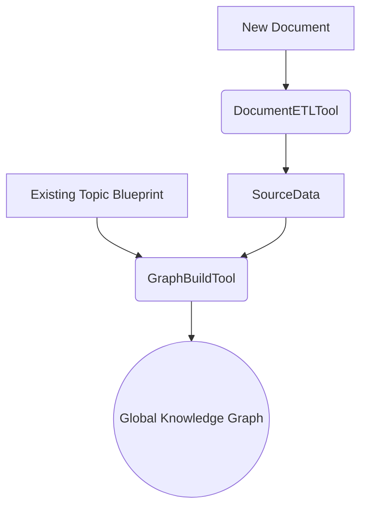
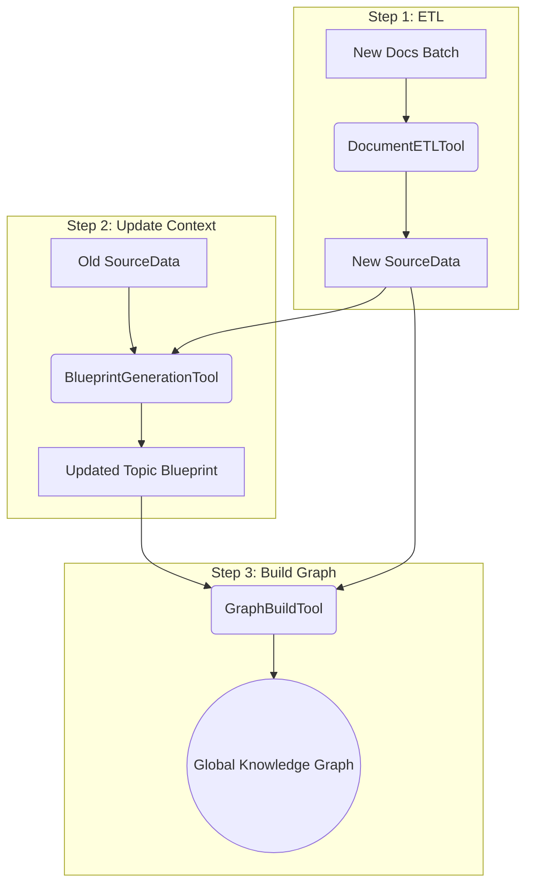
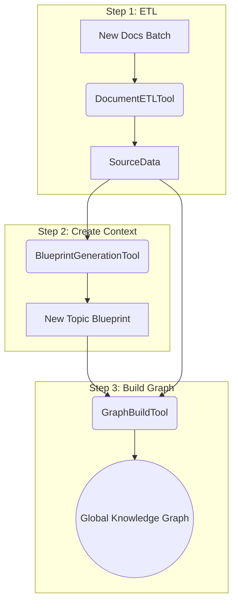
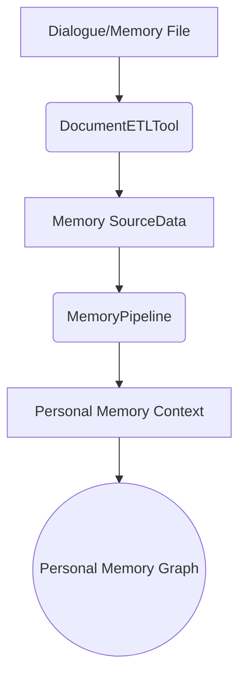
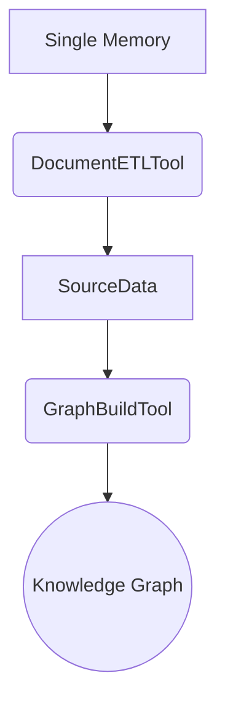

# Progress and Next Steps v2

## Completed Works

### Available Tools
We have three main tools working together in flexible pipelines:

1. **DocumentETLTool** - Processes individual documents to SourceData
2. **BlueprintGenerationTool** - Creates topic analysis blueprints  
3. **GraphBuildTool** - Builds knowledge graph from documents using blueprints

### Unified API Integration
The `/api/v1/save` endpoint now uses PipelineOrchestrator to dynamically select appropriate pipelines based on context.

Current `/api/v1/save` endpoint:
- Migration to tool-based pipeline execution
- Support for process_strategy parameter
- Integration with PipelineOrchestrator

## Example Processing Pipelines

### Scenario 1: Single Document to Existing Topic
**Flow:** DocumentETLTool → GraphBuildTool (using existing blueprint)

### Scenario 2: Batch Documents to Existing Topic
**Flow:** DocumentETLTool (parallel) → BlueprintGenerationTool → GraphBuildTool (parallel)

### Scenario 3: New Topic with Batch Documents
**Flow:** DocumentETLTool (parallel) → BlueprintGenerationTool → GraphBuildTool (parallel)

### Scenario 4: Memory Dialogues
**Flow:** DocumentETLTool → MemoryPipeline → Personal Memory Storage

### Scenario 5: Memory Single Processing
**Flow:** DocumentETLTool → GraphBuildTool (single memory document)

### Current State

The system basically follows the pipeline design as follows:
- SmartSave API → PipelineAPIIntegration →
PipelineOrchestrator → Tools → Knowledge Graph

**Pipeline strategies available:**
- `knowledge_graph_single`: ["etl", "graph_build"]
- `knowledge_graph_batch_new`: ["etl", "blueprint_gen", "graph_build"]
- `knowledge_graph_batch_existing`: ["etl", "blueprint_gen", "graph_build"]
- `memory_direct_graph`: ["graph_build"]
- `memory_single`: ["graph_build"]

## Next Steps to Consider
### 0. Verification
- Verify the consistencies between different functions, as well as the correctness of functions calling.

### 1. Testing & Examples
- Create sample scripts for all pipeline scenarios
    (1) Single document to existing topic
    (2) Batch documents to existing topic
    (3) New topic with batch documents
    (4) Memory Dialogues
- Add unit tests for tool combinations
- Document edge cases (empty documents, duplicate processing, etc.)

### 2. Error Handling Enhancement
- Add retry mechanisms with exponential backoff
- Better error categorization (validation, network, parsing)
- Automatic retry on transient failures

### 3. Performance Monitoring
- Track processing time per tool
- Memory usage monitoring
- Batch processing efficiency metrics

### 4. Document Format Expansion
- Add support for: DOCX, XLSX, PPTX, HTML, XML, JSON, CSV, TSV
- Each format needs specialized extraction handlers
- Update DocumentETLTool format detection