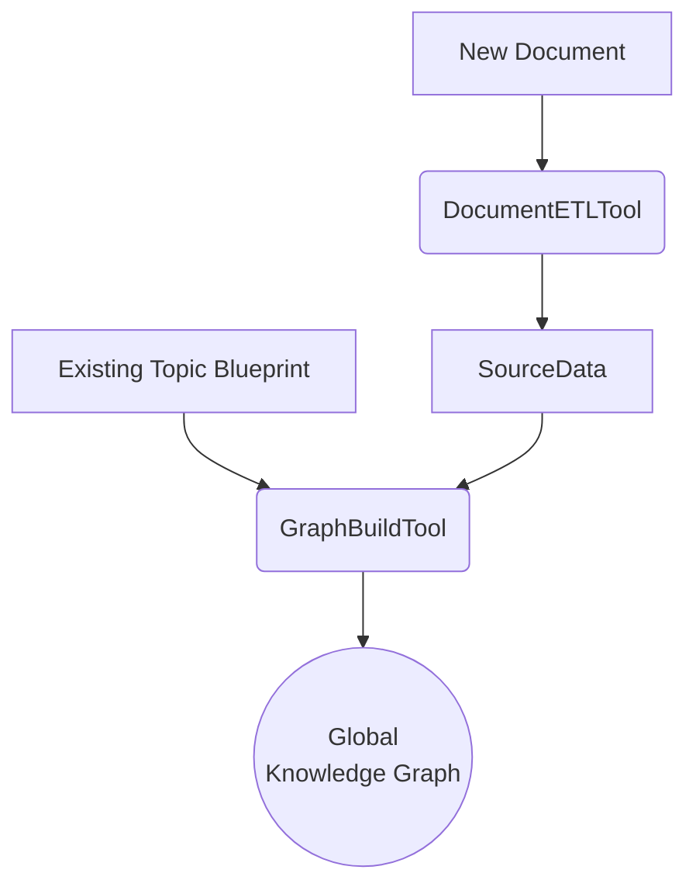
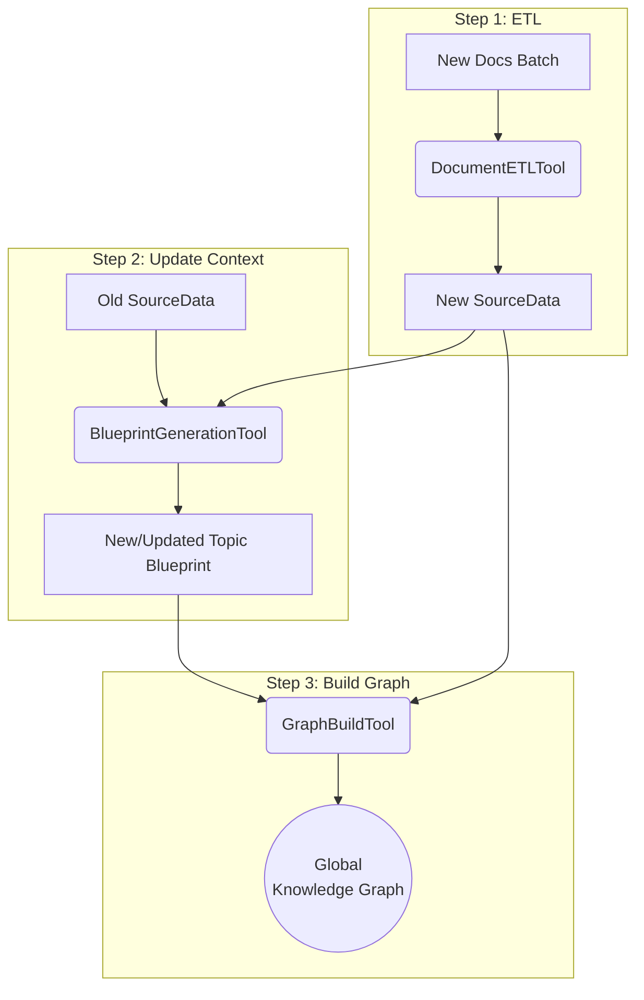
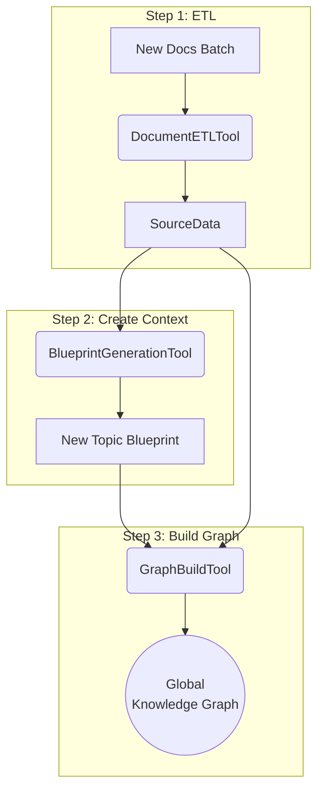

# System Design: Tool-Based Knowledge Graph Construction

It outlines a refined architecture for our knowledge graph construction pipeline. The goal is to create a flexible, scalable, and agentic system by breaking down the process into independent, composable "Tools" that can be orchestrated into "Pipelines" to handle various data processing scenarios.

## 1. Core Problem & Current Limitations

The current system has two main components: an ETL process (`KnowledgeBuilder`) and a Graph construction process (`KnowledgeGraphBuilder`). While functional, this design has limitations:

1.  **Inflexible Pipeline:** The process is largely monolithic. It's difficult to adapt the flow for different scenarios, such as adding a single file to an existing topic versus processing a large batch of files for a new topic.
2.  **Conceptual Confusion:** Core models (like `GraphBuild`) are sometimes used for tracking long-running tasks but are also used in synchronous, in-memory operations, which makes the design unclear.

## 2. Proposed Architecture: Core Concepts

### 2.1. some related concepts

-   **Topic:** A "topic" is a logical grouping for a set of related documents. Its primary purpose is to serve as a context boundary.
-   **Analysis Blueprint:** This is the most critical concept. For each topic, we generate an **Analysis Blueprint** from *all* documents belonging to it. This blueprint contains shared knowledge, key entities, and cross-document insights. It then serves as a crucial input for processing each *individual* document within that topic, ensuring consistency and higher-quality knowledge extraction.

### 2.2. Tool: The Smallest Unit of Work

A "Tool" is a stateless, independent function that performs a single, well-defined task. Our system will be built from three core tools:

1.  **`DocumentETLTool`** 
    -   **Purpose:** To process a single raw document file.
    -   **Input:** Raw file (e.g., PDF, TXT), Topic ID.
    -   **Output:** Structured `SourceData` (text, initial entities, etc.).
    -   **Maps to:** `KnowledgeBuilder.build_from_file` logic.

2.  **`BlueprintGenerationTool`** 
    -   **Purpose:** To create or update the shared context for a topic.
    -   **Input:** All `SourceData` associated with a Topic.
    -   **Output:** A new `AnalysisBlueprint` for the Topic.
    -   **Maps to:** New logic that analyzes multiple documents to find shared themes and entities.

3.  **`GraphBuildTool`** 
    -   **Purpose:** To extract knowledge from a single document and add it to the global graph.
    -   **Input:** A single `SourceData` object and its topic's `AnalysisBlueprint`.
    -   **Output:** New nodes and relationships added to the global knowledge graph.
    -   **Maps to:** `KnowledgeGraphBuilder.build` logic, but enhanced to use the `AnalysisBlueprint` as context.

## 3. Example Processing Pipelines

The power of this architecture is its flexibility. The orchestrator can dynamically create pipelines by sequencing tools to fit the specific need. The following scenarios are just **examples** of how this could work.

### Scenario 1: Adding a Single New Document to an Existing Topic

This is the simplest case. We assume the existing `AnalysisBlueprint` for the topic is still valid and sufficient.

**Pipeline Flow:**
1.  **`DocumentETLTool`**: Process the new file to create its `SourceData`.
2.  **`GraphBuildTool`**: Use the **existing** `AnalysisBlueprint` of the topic along with the new `SourceData` to enrich the global graph.



### Scenario 2: Adding a Batch of New Documents to an Existing Topic

When adding multiple documents, the core understanding of the topic may change. Therefore, we must update the blueprint.

**Pipeline Flow:**
1.  **`DocumentETLTool` (Parallel)**: Run ETL on all new documents to create their `SourceData`.
2.  **`BlueprintGenerationTool`**: Generate a **new** `AnalysisBlueprint` using the combined `SourceData` of **all** documents in the topic (both old and new).
3.  **`GraphBuildTool` (Parallel)**: Run the graph build tool for each **new** document, using the newly created blueprint.



### Scenario 3: Creating a New Topic with a Batch of Documents

This is the process for creating a topic from scratch.

**Pipeline Flow:**
1.  **`DocumentETLTool` (Parallel)**: Run ETL on all documents in the batch to create their `SourceData`.
2.  **`BlueprintGenerationTool`**: Generate the **first** `AnalysisBlueprint` for the new topic from all the newly created `SourceData`.
3.  **`GraphBuildTool` (Parallel)**: Run the graph build tool for each document, using the new blueprint.



## 4. The `ingest` Endpoint: A Flexible Pipeline Orchestrator

The ultimate goal of this design is to transform the primary data ingestion endpoint (`/api/v1/save` in `api/ingest.py`) into a flexible pipeline orchestrator. This endpoint will become the foundation for all knowledge processing, moving from fixed logic to a dynamic, tool-based system.

This approach will be governed by the `process_strategy` parameter in the API request, enabling two primary modes of operation:

### 4.1. Explicit Pipeline Execution

For maximum control, a user (or a future agent) can define a specific pipeline directly within the `process_strategy` of their API call. This allows for custom, on-the-fly workflows tailored to a specific task.

**Conceptual Request Body:**
```json
{
  "target_type": "knowledge_graph",
  "metadata": { "topic_name": "New Topic" },
  "process_strategy": {
    "pipeline": ['etl', 'blueprint_gen', 'graph_build']
  }
}
```

### 4.2. Default Pipeline Selection

If the `process_strategy` is not provided, the endpoint will intelligently select a pre-defined, default pipeline. This selection will be based on the context of the request, such as:
- `target_type` (e.g., `knowledge_graph` vs. `personal_memory`)
- File type of the input document (e.g., `PDF`, `TXT`)
- Whether the topic is new or existing.

This provides sensible, out-of-the-box behavior while retaining the power of customization.

### 4.3. Foundation for an Agentic & Extensible System

This architecture is the key to enabling a more advanced, agentic system. By exposing a clear set of tools and a flexible pipeline execution mechanism, we empower a future agent to reason about a task, dynamically assemble the necessary tools into a pipeline, and execute it to achieve its goal.

Furthermore, this design is highly extensible. As we develop new capabilities, we can simply implement them as new, self-contained tools (e.g., `GraphOptimizationTool`, `DataGleaningTool`). These tools can then be immediately incorporated into new or existing pipelines without requiring changes to the core orchestration logic, facilitating continuous improvement and expansion of the graph's quality and capabilities.

## 5. Summary

This tool-based architecture provides a clear, modular, and flexible foundation. By combining a set of powerful tools with a dynamic orchestrator at the API endpoint, we can execute both default and user-defined pipelines. This creates a truly agentic system capable of adapting to diverse and evolving data processing requirements.

 